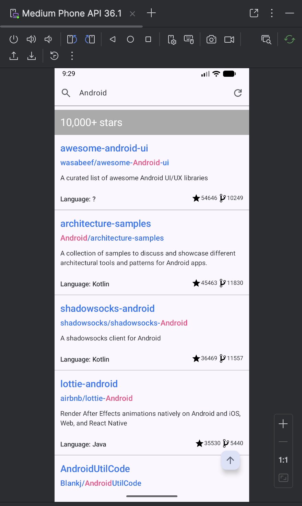

## Demo Android App Searching GitHub Repository
- A demo app to showcase some latest Android development techniques in Jetpack Compose
- Inspired by a deprecated [Android Paging Advanced codelab](https://developer.android.com/codelabs/android-paging), using latest techniques and adding more advanced features
  - I did not find a replacement for that codelab

## Key points
- Searching the repository's full name by sending HTTP requests by Ktor client
- Display the results by Paging 3 + RemoteMediator + LazyColumn, 
  - The cache is organized by search input and stored by Room to local database through RemoteMediator
  - Support updating `Flow<PagingData<T>>` in a memory leak avoiding way when query changes to display different cached searching results for different query input
  - Support manually cache invalidation by both a refresh button and PullToRefreshBox (default: invalidated after 24 hours)
  - Support efficient Room cache management
  - Two mode: `use_room_cache` (Paging3 + RemoteMediator) or not (Paging3 only)
  - Support displaying loading state, retry button on loading failure and scrolling to top button
- Dependency injection by Koin annotation
  - ViewModel injection combined with Navigation 3 and parameter passing
  - Injecting values from property files in `src/main/assests`
  - Using Koin annotation to perform dependency injection that looks like Spring DI
- Use Navigation 3 to display a detail page
- Implemented by following Clean Architecture

## Techniques used
- Jetpack Compose
- Paging 3 + RemoteMediator
- Navigation 3
- Koin Annotation
- Ktor Client
- Room

## Screenshot

